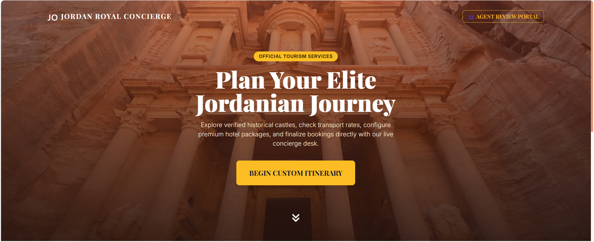
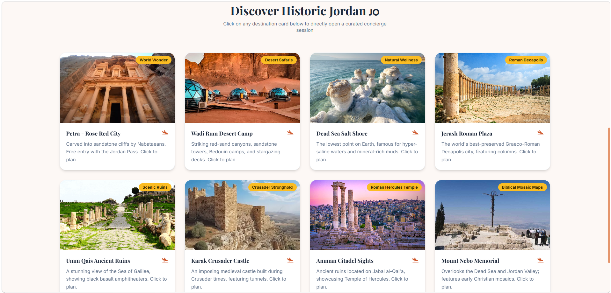

# 🇯🇴 Jordan Travel Concierge

An **Agentic AI-powered travel planning platform** designed to create personalized travel experiences across Jordan.

The system combines **Large Language Models (LLMs), tool calling, persistent traveler memory, database-backed travel services, trip optimization, cost estimation, and a full-stack interactive interface** to support travelers throughout the trip-planning journey.

---

## ✨ Overview

Jordan Travel Concierge goes beyond a traditional chatbot.

Instead of only generating text responses, the system is designed as an intelligent travel agent capable of understanding traveler preferences, maintaining conversation context, calling specialized travel tools, searching available services, estimating trip costs, and supporting multi-step travel planning.

The platform focuses on Jordanian destinations including:

- Petra
- Wadi Rum
- Dead Sea
- Amman
- Jerash
- Umm Qais
- Karak
- Mount Nebo

---

## 🚀 Key Features

### 🤖 Agentic AI Travel Assistant
Uses an LLM-based agent capable of deciding when external tools are required and orchestrating them during the conversation.

### 🧠 Persistent Traveler Memory
Maintains structured traveler information across the conversation, including:

- Destination
- Number of travelers
- Budget
- Trip duration
- Travel dates
- Hotel preferences
- Transportation preferences
- Interests
- Accessibility requirements
- Special requests

### 🏨 Travel Service Search
Specialized tools support searches for:

- Hotels
- Activities
- Transportation options

The agent is designed to use structured travel data rather than inventing travel services or prices.

### 💰 Trip Cost Estimation
Calculates trip costs using dedicated business logic instead of relying on LLM-generated calculations.

### 📊 Trip Optimization
Supports trip optimization based on traveler preferences and constraints such as budget and accommodation choices.

### 🔄 What-If Trip Simulation
Travelers can explore how changes to their trip may affect the overall plan.

Examples include changing:

- Hotel
- Transportation
- Trip duration
- Travel preferences

### 📚 Knowledge Retrieval
Includes a tourism knowledge base for retrieving information such as:

- Frequently asked questions
- Visa information
- Cancellation policies

### 🗺️ Interactive Travel Experience
The frontend provides more than a basic chat interface and includes:

- Traveler chat
- Live traveler memory profile
- Interactive route visualization
- Destination discovery
- Trip planning interface
- Agent review experience

### 👤 Human / Agent Review
Includes an agent-facing workflow for reviewing traveler information and supporting travel sales operations.

### 🧪 Agent Evaluation
The project contains evaluation scenarios designed to test behaviors including:

- Tool selection
- Memory usage
- Missing information
- Budget constraints
- Multi-step planning
- No-result scenarios
- Confirmation requirements
- Unsupported actions
- Traveler preference changes

---

## 🏗️ System Architecture

```text
Traveler
   │
   ▼
Interactive Web Interface
   │
   ▼
FastAPI Backend
   │
   ▼
Agentic AI Orchestrator
   │
   ├── Traveler Memory
   │
   ├── Hotel Search
   │
   ├── Activity Search
   │
   ├── Transportation Search
   │
   ├── Trip Cost Estimation
   │
   ├── Trip Optimization
   │
   ├── What-If Simulation
   │
   ├── Knowledge Retrieval
   │
   └── Travel Operations
   │
   ▼
Database & Knowledge Base
```

---

## 🛠️ Tech Stack

**AI & Backend**
- Python
- Large Language Models (LLMs)
- Agentic AI
- Tool Calling
- FastAPI
- Pydantic
- SQLAlchemy

**Data & Persistence**
- SQL Database
- Persistent Conversation Memory
- Structured Traveler Profiles
- Tourism Knowledge Base

**Frontend**
- HTML
- Tailwind CSS
- DaisyUI
- JavaScript
- Leaflet
- Chart.js

**Development & Deployment**
- Docker
- Docker Compose
- REST APIs
- Git
- GitHub

---

## 📸 Screenshots

### Home & Destination Experience



### Discover Jordan



---

## 📁 Project Structure

```text
jordan-travel-concierge/
│
├── evaluation/
│   ├── agent_dataset.json
│   ├── evaluate_agent.py
│   └── evaluation results
│
├── migrations/
│
├── src/
│   ├── knowledge_base/
│   ├── prompts/
│   ├── services/
│   ├── templates/
│   ├── tools/
│   │
│   ├── agent_core.py
│   ├── business_logic.py
│   ├── config.py
│   ├── database.py
│   ├── llm_client.py
│   ├── main.py
│   ├── mcp_server.py
│   ├── models.py
│   ├── schemas.py
│   └── seed_data.py
│
├── static/
│
├── .env.example
├── .gitignore
├── Dockerfile
├── docker-compose.yml
├── requirements.txt
└── run.py
```

---

## ⚙️ Installation

### 1. Clone the repository

```bash
git clone https://github.com/layanalkhawaldeh/jordan-travel-concierge.git
cd jordan-travel-concierge
```

### 2. Install dependencies

```bash
pip install -r requirements.txt
```

### 3. Configure environment variables

Create a `.env` file using `.env.example` as a template.

```env
GEMINI_API_KEY=your_api_key_here
DEFAULT_MODEL=your_default_model_here
PRO_MODEL=your_pro_model_here
```

> Never commit API keys or other secrets to GitHub.

### 4. Run the application

```bash
python -m uvicorn src.main:app --reload
```

Then open:

```text
http://127.0.0.1:8000
```

---

## 🧠 Agent Design

The travel agent follows a controlled decision-making workflow.

It first understands the traveler request and updates the persistent traveler profile.

Depending on the request, the agent can decide whether it needs to:

1. Answer using existing traveler memory.
2. Request missing information.
3. Search structured travel services.
4. Retrieve tourism knowledge.
5. Calculate trip costs.
6. Optimize a proposed trip.
7. Simulate requested changes.
8. Prepare travel planning information.
9. Request confirmation before sensitive actions.

This architecture helps reduce hallucinations by separating **language generation** from **business operations and structured data retrieval**.

---

## 🧪 Evaluation

The project includes dedicated evaluation scenarios for testing the behavior of the AI agent.

The evaluation framework considers areas such as:

- Correct tool selection
- Multi-step task execution
- Memory handling
- Constraint satisfaction
- Missing-information handling
- No-result scenarios
- Confirmation requirements
- Unsupported actions
- Agent latency and execution behavior

This allows the system to be evaluated as an **AI application**, rather than evaluating only individual LLM responses.

---

## 🔐 Safety & Reliability

The system is designed around several reliability principles:

- Travel services and prices should come from tools rather than LLM invention.
- Important trip calculations are handled through deterministic business logic.
- Traveler memory is updated from explicit user information.
- Sensitive write actions require confirmation.
- Tool failures should be surfaced instead of replaced with fabricated results.
- Secrets and API credentials are stored outside the source code.

---

## 🔮 Future Improvements

- Improve agent tool-call reliability
- Expand the Jordan tourism database
- Integrate additional live travel APIs
- Improve retrieval quality
- Add richer itinerary generation
- Improve hotel and activity recommendation ranking
- Expand automated agent evaluation
- Improve production deployment and monitoring

---

## 👩‍💻 Author

**Layan Alkhawaldeh**  
AI Engineer | Artificial Intelligence & Data Science

GitHub: [layanalkhawaldeh](https://github.com/layanalkhawaldeh)

LinkedIn: [Layan Alkhawaldeh](https://www.linkedin.com/in/layan-alkhawaldeh-025977325/)
